# Introduction to PHP and MySQL and phpMyAdmin with MAMP (or XAMPP)

<!---->


## Introduction to PHP

**PHP** (*recursive acronym for PHP: Hypertext Preprocessor*) is a widely-used **open source general-purpose scripting language** that is especially suited for web development and can be embedded into HTML.

PHP was created by Danish-Canadian programmer **Rasmus Lerdorf** in 1994, and launched as Personal Home Page Tools (PHP Tools) version 1.0 on June 8, 1995.

<!---->


[Wikipedia: PHP](https://en.wikipedia.org/wiki/PHP)

## How does PHP work?

**PHP code is executed on the server, generating HTML which is then sent to the client.**

The client would receive the results of running that script, but would not know what the underlying code was.

PHP is extremely simple for a newcomer, but offers many advanced features for a professional programmer.

PHP is its support for a wide range of databases, like **MySQL**.

## What Can PHP Do?

PHP can:
* generate **dynamic page content**
* create, open, read, write, delete, and close **files** on the server
* collect **form data**
* send and receive **cookies**
* add, delete, modify data in your **database**
* be used to control **user-access**
* **encrypt** data

## What is a PHP File?

* PHP files can contain: 
    * text
    * HTML 
    * CSS 
    * JavaScript
    * PHP code
* PHP code is **executed on the server**, and the result is returned to the browser as plain HTML (or other defined format)
* PHP files have extension "`.php`"

## PHP Hello World

Make an `example.php` file in your local folder:
```php
<!DOCTYPE html>
<html>
    <head>
        <title>Example</title>
    </head>
    <body>

        <?php
            echo "Hi, I'm a PHP script!";
        ?>

    </body>
</html>
```

Open it in your browser, what happens?

Normally one of two things: 
1. The browser downloads the file, or
2. The browser treats it like a text file and shows it with tags and all (PHP and HTML): 

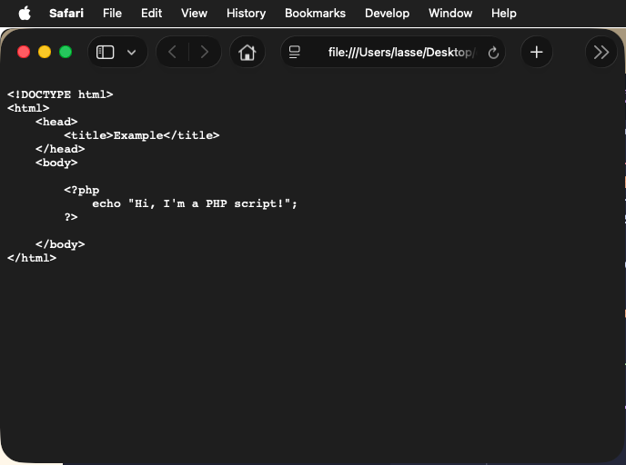
<!-- @TODO: Swap this for a better image -->

This is because you need to run the PHP file through a web server, one  that supports PHP.

VS Code's Live Server does not support that, so this is where MAMP (XAMPP) comes in, and with the added bonus of including a working MySQL database and phpMyAdmin. More on that later.

## Set up MAMP (or XAMPP)

Download and install [MAMP](https://www.mamp.info/en/mac/) (for Mac) or [XAMPP](https://www.apachefriends.org/download.html) (for Windows and Linux).

Using MAMP for local environment, use Finder and navigate to `MAMP` > `htdocs` and delete the `index.php` file. 

<small>If you're [using XAMPP for Windows](https://www.freecodecamp.org/news/how-to-get-started-with-php/), the default folder _should_ be `c:\xampp\htdoc`, but YMMV.</small>

Make a new `index.php` file with the content from the `example.php` file above. 

Now start up MAMP (or XAMMP) and Start Apache.

From the `localhost:8888/MAMP/` page Goto "My Website" 
<small>(or just navigate to `localhost:8888` (MAMP) or `localhost` without the port (XAMPP))</small>

## "Hello, world" example explained

```php
<?php 
    echo "Hi, I'm a PHP script!"; 
?>
```

PHP pages contain HTML with embedded code that does "something" (in this case, output "*Hi, I'm a PHP script!*"). 

The PHP code is enclosed in special start and end processing instructions 
`<?php` and `?>` that allow you to jump into and out of "PHP mode."

`echo` — Output one or more strings, [docs](https://www.php.net/manual/en/function.echo.php).

**Note**: PHP statements end with a semicolon, `;`. As opposed to JavaScript this is mandatory (in almost all cases),

## PHP Case Sensitivity
In PHP, keywords (e.g. if, else, while, echo, etc.), classes, functions, and user-defined functions are not case-sensitive.

In the example below, all three echo statements below are equal and legal:

```php
<?php
ECHO "Hello World!<br>";
echo "Hello World!<br>";
EcHo "Hello World!<br>";
?>
```

**Note**: However, all variable names are case-sensitive!

Look at the example below; only the first statement will display the value of the `$color` variable! This is because `$color`, `$COLOR`, and `$coLOR` are treated as three different variables:

```php
<?php
$color = "red";
echo "My car is " . $color . "<br>";
echo "My house is " . $COLOR . "<br>";
echo "My boat is " . $coLOR . "<br>";
?>
```

## PHP Variables

In PHP, a variable starts with the `$` sign, followed by the name of the variable:

```php
<?php
$txt = "Hello world!";
$x = 5;
$y = 10.5;
?>
```

> Unlike other programming languages, PHP has no command for declaring a variable. It is created the moment you first assign a value to it.

### Rules for PHP variables:

* A variable starts with the `$` sign, followed by the name of the variable
* A variable name must start with a letter or the underscore character
* A variable name **cannot** start with a number
* A variable name can only contain **alpha-numeric characters** and **underscores** 
(A-z, 0-9, and _ )
* Variable names are case-sensitive ($age and $AGE are two different variables)

### PHP is a Loosely Typed Language
In the example above, notice that we did not have to tell PHP which data type the variable is.

PHP automatically associates a data type to the variable, depending on its value. Since the data types are not set in a strict sense, you can do things like adding a string to an integer without causing an error.

In **PHP 7**, type declarations were added. This gives an option to specify the data type expected when declaring a function, and by enabling the `strict` requirement, it will throw a "Fatal Error" on a type mismatch.

[PHP `strict_types` tutorial](https://www.phptutorial.net/php-tutorial/php-strict_types/).

## Comments

PHP supports 'C', 'C++' and Unix shell-style (Perl style) comments. For example:

```php
<?php
    echo 'This is a test'; // This is a one-line c++ style comment
    /* This is a multi line comment
       yet another line of comment */
    echo 'This is yet another test';
    echo 'One Final Test'; # This is a one-line shell-style comment
?>
```

You can also add comments (eg. to "comment out" code in inline PHP tags):

```php
<h1>This is an <?php # echo 'easy';?> example</h1>
<p>The header above will say 'This is an  example'.</p>
```

## PHP `echo` and `print` Statements

`echo` and `print` are more or less the same. They are both used to output data to the screen.

* `echo` has no return value while `print` has a return value of 1 so it can be used in expressions. 
* `echo` can take multiple parameters (although such usage is rare) while `print` can only take one argument. 
* `echo` is marginally faster than `print`.

### The PHP echo Statement

The echo statement can be used with or without parentheses: `echo` or `echo()`.

The following example shows how to output text with the echo command (notice that the text can contain HTML markup):
```php
<?php
echo "<h2>PHP is Fun!</h2>";
echo "Hello world!<br>";
echo "I'm about to learn PHP!<br>";
echo "This ", "string ", "was ", "made ", "with multiple parameters.";
?>

// <h2>PHP is Fun!</h2>
// Hello world!<br>
// I'm about to learn PHP!<br>
// This string was made with multiple parameters.
```

The following example shows how to output text and variables with the echo statement:
```php
<?php
$txt1 = "Learn PHP";
$txt2 = "W3Schools.com";
$x = 5;
$y = 4;

echo "<h2>" . $txt1 . "</h2>";
echo "Study PHP at " . $txt2 . "<br>";
echo $x + $y;
?>

// <h2>Learn PHP</h2>
// Study PHP at W3Schools.com<br>
// 9
```

**Notice**: `.` is used for string concatenation, not `+` that JS uses. PHP treats `+` as a numeric operator only.

[String Operators](https://www.php.net/manual/en/language.operators.string.php)

### The PHP print Statement
The print statement can *also* be used with or without parentheses: `print` or `print()`.

The following example shows how to output text with the print command (notice that the text can contain HTML markup):

```php
<?php
print "<h2>PHP is Fun!</h2>";
print "Hello world!<br>";
print "I'm about to learn PHP!";
?>

// <h2>PHP is Fun!</h2>
// Hello world!<br>
// I'm about to learn PHP!
```

The following example shows how to output text and variables with the print statement:

```php
<?php
$txt1 = "Learn PHP";
$txt2 = "W3Schools.com";
$x = 5;
$y = 4;

print "<h2>" . $txt1 . "</h2>";
print "Study PHP at " . $txt2 . "<br>";
print $x + $y;
?>

// <h2>Learn PHP</h2>
// Study PHP at W3Schools.com<br>
// 9
```

## PHP Data Types
Variables can store data of different types, and different data types can do different things.

PHP supports the following data types:

* String
* Integer
* Float (floating point numbers - also called double)
* Boolean
* Array
* Object
* NULL
* Resource

The special **resource** type is not an actual data type. It is the storing of a reference to functions and resources external to PHP.

A common example of using the resource data type is a **database call**. 


## PHP `var_dump()` Function

`var_dump()` is used to **inspect a variable’s type, value, and structure**, mainly for debugging:


```php
<?php
$a = 42;
echo var_dump($a) . "<br>"; // int(42) 

$b = "Hello world!";
echo var_dump($b) . "<br>"; // string(12) "Hello world!" 

$c = 3.14;
echo var_dump($c) . "<br>"; // float(3.14) 

$d = array("red", "green", "blue");
echo var_dump($d) . "<br>";
// array(3) { [0]=> string(3) "red" [1]=> string(5) "green" [2]=> string(4) "blue" } 

$e = array(32, "Hello world!", 32.5, array("red", "green", "blue"));
echo var_dump($e) . "<br>";
// array(4) { [0]=> int(32) [1]=> string(12) "Hello world!" [2]=> float(32.5) 
// [3]=> array(3) { [0]=> string(3) "red" [1]=> string(5) "green" [2]=> string(4) "blue" } } 

// Dump two variables
echo var_dump($a, $b) . "<br>"; // int(32) string(12) "Hello world!" 
?>
```

It shows:
* the data type
* the value
* lengths of strings
* contents of arrays and objects (recursively)

In short: it is PHP’s blunt but very reliable debugging microscope.


## PHP Conditional Statements

In PHP we have the following conditional statements:

* `if` statement - executes some code if one condition is true
* `if...else` statement - executes some code if a condition is true and another code if that condition is false
* `if...elseif...else` statement - executes different codes for more than two conditions
* `switch` statement - selects one of many blocks of code to be executed

### PHP Conditional Statements, a basic example

```php
<?php
$t = date("H"); // H: 24-hour format of an hour with leading zeros

if ($t < "10") {
  echo "Have a good morning!";
} elseif ($t < "20") {
  echo "Have a good day!";
} else {
  echo "Have a good night!";
}
?>
```

<small>Docs for the [date](https://www.php.net/manual/en/function.date.php) and [DateTime::format](https://www.php.net/manual/en/datetime.format.php).</small>

### PHP alternative control structure syntax

Advanced escaping using conditions:
```php
<?php
  $expression = true;
?>

<?php if ($expression == true): ?>
  This will show if the expression is true.
<?php else: ?>
  Otherwise this will show.
<?php endif; ?>
```
In this example PHP will skip the blocks where the condition is not met, even though they are outside of the PHP open/close tags.

PHP skips them according to the condition since the PHP interpreter will jump over blocks contained within a condition that is not met.

This syntax is common in templates and view files, and rare in pure logic-heavy PHP code.

## PHP Loops

In PHP, we have the following loop types:

* `while` - loops through a block of code as long as the specified condition is true
* `do...while` - loops through a block of code once, and then repeats the loop as long as the specified condition is true
* `for` - loops through a block of code a specified number of times
* `foreach` - loops through a block of code for each element in an array

Loops are used to execute the same block of code again and again, as long as a certain condition is true.

```php
<?php
// while loop
$i = 1;
while ($i <= 3) {
    echo $i;
    $i++;
}
// Output: 123

// for loop
for ($j = 1; $j <= 3; $j++) {
    echo $j;
}
// Output: 123

// foreach loop
$colors = ["red", "green", "blue"];
foreach ($colors as $color) {
    echo $color;
}
// Output: redgreenblue
```

## PHP User Defined Functions

Besides the [built-in PHP functions](https://www.w3schools.com/php/php_ref_overview.asp), it is possible to create your own functions.

* A function is a block of statements that can be used repeatedly in a program.
* A function will not execute automatically when a page loads.
* A function will be executed by a call to the function.

> Note: A function name must start with a letter or an underscore. Function names are NOT case-sensitive.

### Functions, example
```php
<?php
function addNumbers($a, $b = 12) {
  return $a + $b;
}
echo addNumbers(3, 4); // 7 
echo addNumbers(1); // 13
echo addNumbers(5, "5 days"); // 10
?>
```

> "5 days" is changed to int(5), and thus `addNumbers(5, "5 days")` return 10, 
> use *strict mode* in PHP 7+ and set data types if you want to *prevent* this.

## PHP Arrays

In PHP, the `array()` function is used to create an array; of which there are three types:

* Indexed arrays - Arrays with a numeric index
* Associative arrays - Arrays with named keys
* Multidimensional arrays - Arrays containing one or more arrays

The `count()` function is used to return the length (the number of elements) of an array.

Examples:

```php
<?php
// Indexed array
$fruits = array("Apple", "Banana", "Orange");
echo $fruits[0];       // Apple
echo count($fruits);   // 3

// Associative array
$prices = array(
    "Apple" => 10,
    "Banana" => 8,
    "Orange" => 12
);
echo $prices["Banana"]; // 8
echo count($prices);    // 3

// Multidimensional array
$inventory = array(
    array("Apple", 10),
    array("Banana", 8),
    array("Orange", 12)
);
echo $inventory[2][0]; // Orange
echo count($inventory); // 3
?>
```

## PHP Include Files

The `include` (or `require`) statement takes all the text/code/markup that exists in the specified file and copies it into the file that uses the include statement.

Including files is very useful when you want to include the same PHP, HTML, or text on multiple pages of a website.

Example: 

Make three additional files in your MAMP (XAMPP) folder: `home.php`, `about.php` and `header.php`:

### home.php

```php
<!DOCTYPE html>
<html lang="en">
<head>
    <meta charset="UTF-8">
    <meta http-equiv="X-UA-Compatible" content="IE=edge">
    <meta name="viewport" content="width=device-width, initial-scale=1.0">
    <title>Home</title>
</head>
<body>
<?php include "header.php"; ?>
    <h1>Home page</h1>
    <p>Lorem ipsum dolor sit amet consectetur adipisicing elit. 
    Inventore explicabo nemo placeat a officiis maxime 
    praesentium voluptates, possimus soluta eveniet animi 
    incidunt deserunt! Qui enim consequatur illum sit tenetur 
    dolores.</p>
</body>
</html>
```


### about.php

```php
<!DOCTYPE html>
<html lang="en">
<head>
    <meta charset="UTF-8">
    <meta http-equiv="X-UA-Compatible" content="IE=edge">
    <meta name="viewport" content="width=device-width, initial-scale=1.0">
    <title>About</title>
</head>
<body>
<?php include "header.php"; ?>
    <h1>About Me</h1>
    <p>Lorem, ipsum dolor sit amet consectetur adipisicing elit.
    Autem laboriosam reiciendis perferendis veritatis recusandae 
    ab animi, magnam ipsam natus molestias minus error at iusto 
    sunt quia atque a. Mollitia, nobis.</p>
</body>
</html>

```

### header.php

```php
<?php
    //var_dump($_SERVER["PHP_SELF"]);
    $self = $_SERVER["PHP_SELF"];
    //var_dump(strpos($self, "home"));
    //var_dump(strpos($self, "about"));
?>

<nav>
    <ul>
        <li <?php if (strpos($self, "home")) {  
            echo "style='color: lightgrey'"; 
        } ?>>
            <a href="home.php">Home</a>
        </li>
        <li <?php if (strpos($self, "about")) {  
            echo "style='color: lightgrey'"; } 
        ?>>
            <a href="about.php">About</a>
        </li>
    </ul>
</nav>
```

Open the Home file (you may need to navigate to http://localhost:8888/home.php or similar, if you have an index.php file in your MAMP root folder) and use the menu list to navigate to About and back; and notice how the "dot" in the menu list changes colour.

## PHP Global Variables - Superglobals

Some predefined variables in PHP are "superglobals", which means that they are always accessible, regardless of scope - and you can access them from any function, class or file without having to do anything special.

The PHP superglobal variables are: `$GLOBALS`, `$_SERVER`, `$_REQUEST`, `$_POST`, `$_GET`, `$_FILES`, `$_ENV`, `$_COOKIE` and `$_SESSION`

[`$_SERVER`](https://www.php.net/manual/en/reserved.variables.server) holds information about headers, paths, and script locations.

[`$_REQUEST`](https://www.php.net/manual/en/reserved.variables.request.php) is used to collect data after submitting an HTML form.

[`$_POST`](https://www.php.net/manual/en/reserved.variables.post.php) is used to collect form data after submitting an HTML form with method="post". `$_POST` is also widely used to pass variables.

[`$_GET`](https://www.php.net/manual/en/reserved.variables.get.php) is used to collect form data after submitting an HTML form with method="get". `$_GET` can also collect data sent in the URL.

### A very simple form example 

```php
<!DOCTYPE html>
<html>
<body>
    <form method="post" action="<?php echo $_SERVER['PHP_SELF'];?>">
      Name: <input type="text" name="fname">
      <input type="submit">
    </form>
<?php
if ($_SERVER["REQUEST_METHOD"] == "POST") {
    $name = $_REQUEST['fname'];  // collect value of input field
    if (empty($name)) {
        echo "<p>Name is empty</p>";
    } else {
        echo "<p>Input is " . $name . "</p>";
    }
}
?>
</body>
</html>
```

[`empty`](https://www.php.net/manual/en/function.empty): checks whether a variable is empty or not set.

It returns true if the value is considered empty, for example:
* "" (empty string)
* 0 or "0"
* false
* null
* [] (empty array)
* or a variable that does not exist

> PHP’s `empty()` is *stricter and more explicit* than JavaScript truthiness.

## phpinfo

`phpinfo()` is commonly used to check configuration settings and for available predefined variables on a given system.

Example: Make a file called [`phpinfo.php`](https://www.geek.no/noroff/phpinfo.php) and put it on your server (remote or locally), and open in browser:

```php
<?php
// Show all information, defaults to INFO_ALL
phpinfo();

// Show just the module information.
// phpinfo(8) yields identical results.
phpinfo(INFO_MODULES);
?>
```
[phpinfo](https://www.php.net/manual/en/function.phpinfo.php)

**Tip**: In MAMP you can access `phpinfo` right from your start page, from the MAMP Tools menu:


---

## MySQL
<!-- https://en.wikipedia.org/wiki/MySQL -->
<!-- https://www.w3schools.com/mysql/ -->

**MySQL** is an open-source relational database management system (RDBMS).

MySQL is a component of the LAMP web application software stack (and others), which is an acronym for 
* **L**inux, 
* **A**pache, 
* **M**ySQL, 
* **P**HP (Perl/Python). 

MySQL is used by many database-driven web applications, including Drupal, Joomla, phpBB, and WordPress. 

<!---->


## What is a Table?

A database table is a structure that organises data into rows and columns – forming a grid.

Tables are similar to a worksheets in spreadsheet applications. The rows run horizontally and represent each record. The columns run vertically and represent a specific field. The rows and columns intersect, forming a grid. The intersection of the rows and columns defines each cell in the table.


The header cell of a column usually displays the name of the column. The column is usually named to reflect the contents of each cell in that column. For example, a column name of FirstName could be used to reflect that the cells will contain the first name of an individual.

The rows don’t typically have a header cell as such, but often the first column will contain a **unique identifier** – such as an ID. This field is often assigned as the **primary key**,  as a primary key requires a unique identifier (i.e. the value of this field will be different for each record).

This means that we can identify each record by its ID (or other unique identifier). Therefore, tables can reference records in other tables simply by referring to the record’s primary key value. In this case, the tables have a relationship. This is where the relational part comes from relational database management systems.

Source: [Database.Guide: What is a Table?](https://database.guide/what-is-a-table/)

## CRUD vs HTTP Methods vs SQL

CRUD | HTTP Methods | SQL
--- | --- | ---
CREATE | POST (or PUT) | INSERT INTO 
READ | GET | SELECT
UPDATE | PUT | UPDATE
DELETE | DELETE | DELETE

## Some of the Most Important SQL Commands

`SELECT` - extracts data from a database
`UPDATE` - updates data in a database
`DELETE` - deletes data from a database
`INSERT INTO` - inserts new data into a database
`CREATE DATABASE` - creates a new database
`ALTER DATABASE` - modifies a database
`CREATE TABLE` - creates a new table
`ALTER TABLE` - modifies a table
`DROP TABLE` - deletes a table
`CREATE INDEX` - creates an index (search key)
`DROP INDEX` - deletes an index


# phpMyAdmin

phpMyAdmin is a free software tool written in PHP, intended to handle the administration of MySQL over the Web. phpMyAdmin supports a wide range of operations on MySQL and MariaDB. 

Frequently used operations (managing databases, tables, columns, relations, indexes, users, permissions, etc) can be performed via the user interface, while you still have the ability to directly execute any SQL statement.

Most webhotels supporting PHP/MySQL will have phpMyAdmin pre-installed.

Easiest way to try it on your local machine is to run [MAMP](https://www.mamp.info/en/mamp/) (or similar):

<!--
https://hostadvice.com/how-to/how-to-use-phpmyadmin/#paragraph5
https://www.siteground.com/tutorials/phpmyadmin/database-management/
-->

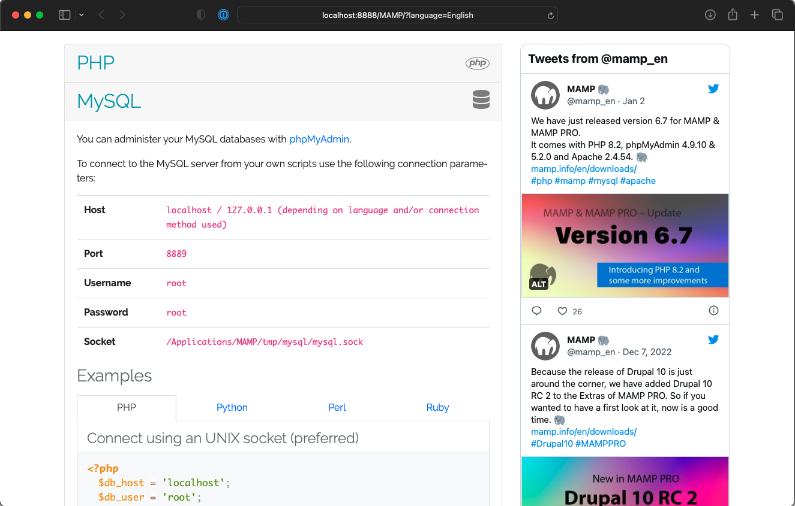

<small>Running MAMP, scroll down to MySQL for link to phpMyAdmin, info, and code examples for relevant languages, incl. PHP.</small>

You can also access phpMyAdmin via the Tools menu:


Default MySQL db setup on MAMP:
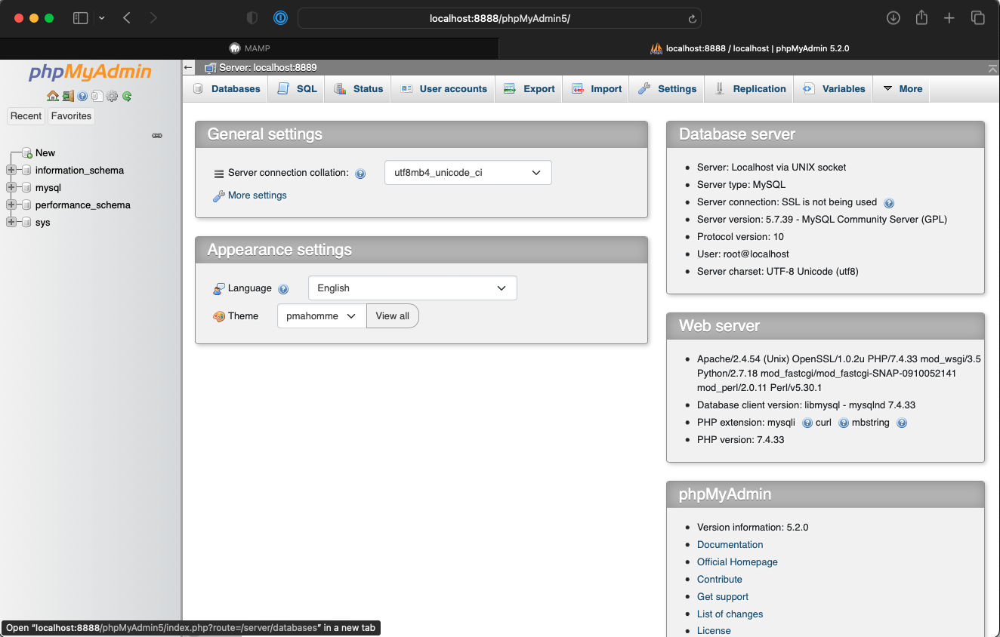

## Practical example: Create a new database

Click the "**New**" db "link" or access the "**Databases**" tab:

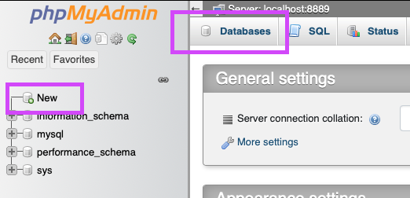

Use "Create database", give the database a name, and click create:

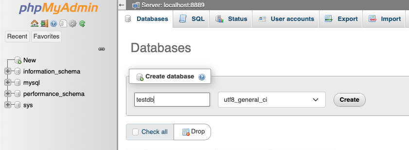

Notice you've moved into the new database, and are now in the tab "Structure", which let's you "Create new table".

Make your first table by giving it a name and number of columns:

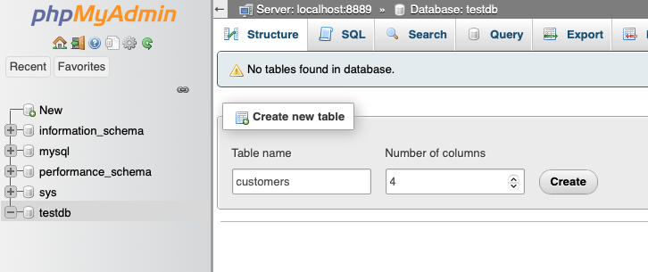

Give the table columns name and [**datatype**](https://www.w3schools.com/mysql/mysql_datatypes.asp) (e.g. varchar, integer, date, etc.):

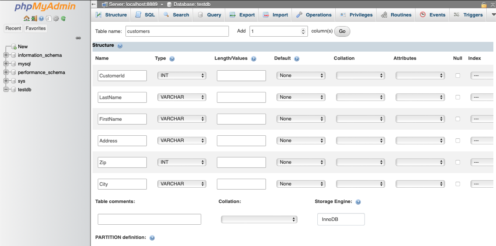

**Tip 1**: If you need additional columns, click Add 1 (or more) column(s): 

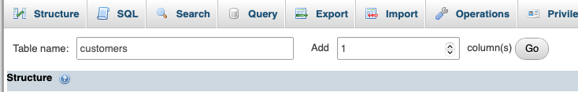

**Tip 2**: Preview your SQL: 

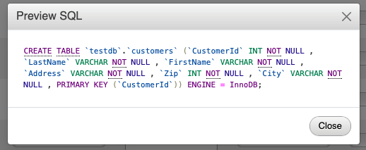

Note that here all fields have been set to "Not null", click the "Null" checkbox to allow some of the columns to allow `null` values (eg. FitstName and Address).


**Tip 3**: Remember to check `A_I` to add AUTO INCREMENT to the CustomerId and make it your **Primary Key**:

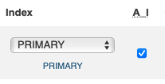

**Tip 4**: Remember to add Length to all columns with varchar datatype: 


**Tip 5**: Make sure `LastName` and `Address` accepts `null` values by checking the `Null` checkbox: 

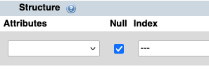

<small>Note: Screenshot has FirstName as a possible NULL value, but we've changed that to make LastName as a possible NULL value instead.</small>

Then click the **Save** button, to see the new table's structure:

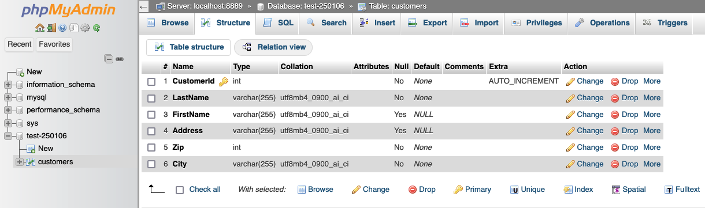

Go to the SQL tab:

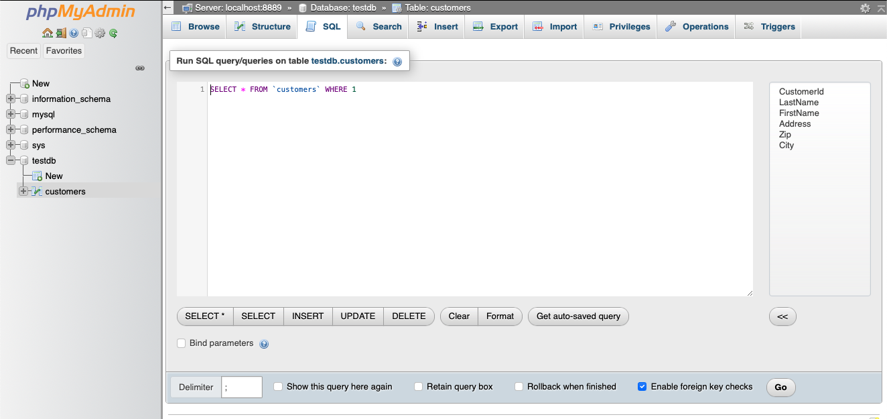

### INSERT INTO

Use SQL to insert your first record, with `INSERT INTO`, and click "Go":

```sql
INSERT INTO `customers` (
    `LastName`, `FirstName`, `Address`, `Zip`, `City`
)
VALUES(
    'Olsen', 'Ole', 'Oppveien 12', '1234', 'Stedet'
)
```

* `INSERT INTO` customers tells MySQL you want to add a new row to the customers table
* The column list `(LastName, FirstName, Address, Zip, City)` specifies which fields you are providing values for
* `VALUES (...)` contains the data to insert, in the same order as the column list

This query adds one new customer with the given name and address details:

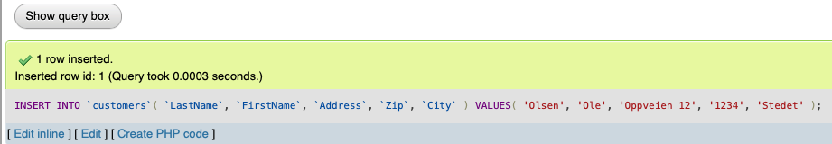

**Did you notice that we did not insert any number into the CustomerId field?**
The CustomerId column is an *auto-increment field* and will be generated automatically when a new record is inserted into the table.


`INSERT` data only in specified columns:

```sql
INSERT INTO `customers` (
    `FirstName`, `Zip`, `City`
)
VALUES(
    'Whatever', '6500', 'Elsewhere'
)
```

### SELECT

Now, get all records using `SELECT`: 

```sql
SELECT * FROM `customers`;
```

* `SELECT` tells MySQL you want to retrieve data
* `*` means “all columns”
* F`ROM customers` specifies the table to read from

So this query returns every column for every row in the customers table:

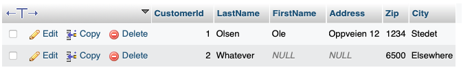

Notice Customer `2` has two columns with `NULL` values.

Add a few more records: 

```sql
INSERT INTO `customers` (
    `LastName`, `FirstName`, `Address`, `Zip`, `City`
)
VALUES
    ('Larsen', 'Lars', 'Nedveien 21', '1234', 'Stedet'), 
    ('Larsen', 'Ole', 'Dill 42', '2000', 'Hvorerdet'), 
    ('Olsen', 'Lars', 'Dall 13', '2000', 'Hvorerdet'), 
    ('Nilsen', 'Nils', 'Nedveien 22a', '1234', 'Stedet'), 
    ('Nilsen', 'Ole', 'Nedveien 22b', '1234', 'Stedet'), 
    ('Pedersen', 'Peder', 'Torget 2', '5000', 'Bergen')
```

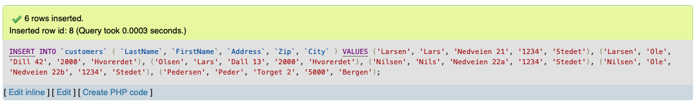

Now, if you use a simple `SELECT`, again, you get all 8 records: 

```sql
SELECT * FROM `customers`;
```

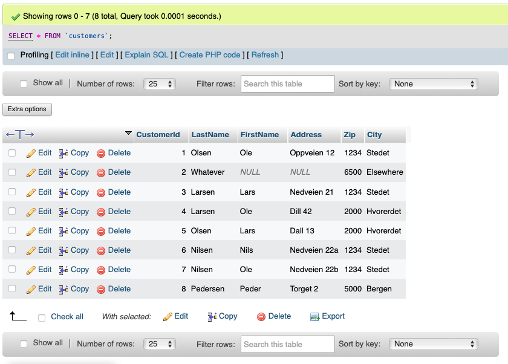

### WHERE

The `WHERE` clause is used to filter records.

It is used to extract only those records that fulfill a specified condition.

```sql
SELECT * FROM `customers`
WHERE FirstName = "Ole";
```

* `WHERE FirstName = "Ole"` **filters** the result

Only rows where the FirstName column has the value "Ole" are returned:

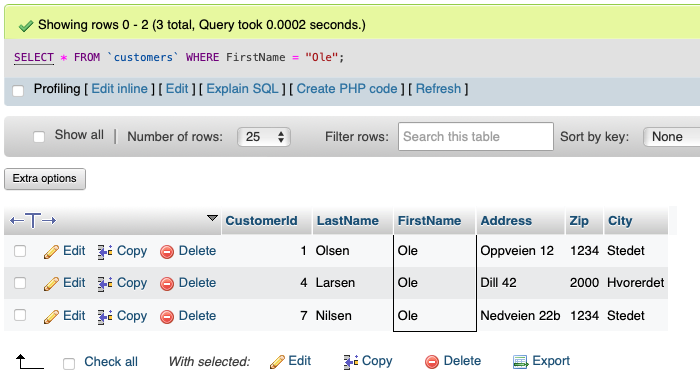

A few more examples:

```sql
SELECT * FROM `customers`
WHERE CustomerId = 7;
```


<br>

```sql
SELECT * FROM `customers`
WHERE Zip = 1234;
```

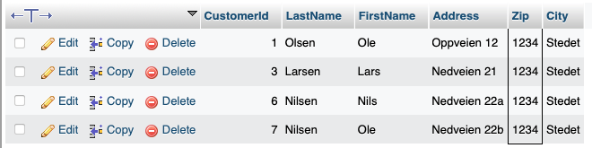

```sql
SELECT * FROM `customers`
WHERE Zip BETWEEN 5000 AND 5999;
```

* `BETWEEN 5000 AND 5999` filters rows by a range

It returns only customers where Zip is 5000 or higher and 5999 or lower (inclusive):


<br>

```sql
SELECT * FROM `customers`
WHERE LastName LIKE "%sen";
```

* `LIKE` matches text patterns
* `%` is a wildcard meaning “any number of characters”
* `"%sen"` matches values that end with `sen`

So this returns customers whose last name ends in 'sen':

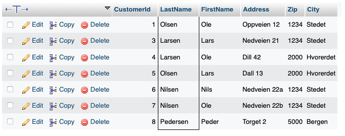

```sql
SELECT * FROM `customers`
WHERE LastName LIKE "%sen" AND Firstname LIKE "o%";
```

* `AND` combines multiple conditions
* Both conditions must be true for a row to match
* `"%sen"` matches last names ending in `sen`
* `"o%"` matches first names starting with `o`

So this returns customers whose last name ends in 'sen':and whose first name starts with 'o':

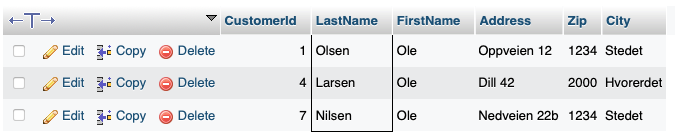

<br>

```sql
SELECT * FROM `customers`
WHERE 
    LastName LIKE "%sen" AND 
    Firstname LIKE "o%" AND
    Zip >= 2000;
```


### Operators, summary

Operator|Description
---|---
`=`|Equal
`>`|Greater than
`<`|Less than
`>=`|Greater than or equal
`<=`|Less than or equal
`<>`|Not equal. &nbsp; &nbsp; &nbsp; *Note*: In some versions of SQL this operator may be written as `!=`
`BETWEEN`|Between a certain range
`LIKE`|[Search for a pattern](https://www.w3schools.com/mysql/mysql_like.asp)
`IN`|To specify multiple possible values for a column

### ORDER BY

The `ORDER BY` keyword is used to sort the result-set in ascending or descending order.

The `ORDER BY` keyword sorts the records in ascending order by default. To sort the records in descending order, use the `DESC` keyword.

```sql
SELECT * FROM `customers`
ORDER BY LastName;
```

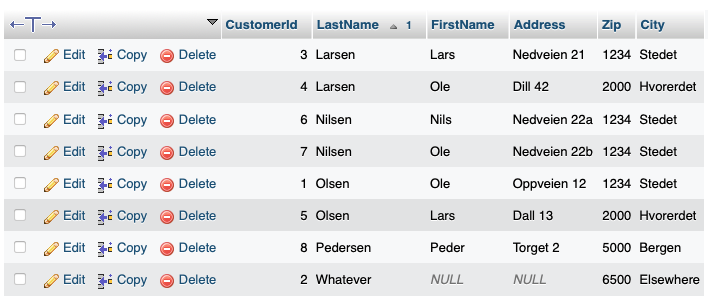

#### ORDER BY Several Columns

```sql
SELECT * FROM `customers`
ORDER BY LastName, FirstName;
```

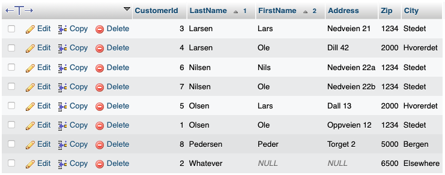

<small>*Notice how Lars and Ole Olsen changed places.*</small>

#### Combining WHERE and ORDER BY

```sql
SELECT * FROM `customers`
WHERE LastName LIKE "%sen" AND Firstname LIKE "l%"
ORDER BY zip DESC;
```

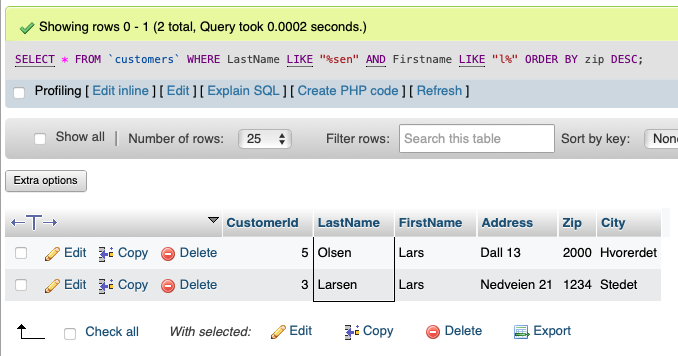

### UPDATE

The `UPDATE` statement is used to modify the existing records in a table.


```sql
UPDATE `customers`
SET Firstname = "Lars Erik"
WHERE CustomerId = 3;
```

* `UPDATE customers` tells MySQL you want to change existing data
* `SET Firstname = "Lars Erik"` specifies the new value
* `WHERE CustomerId = 3` limits the change to the row with that ID

So this updates the first name of the customer with `CustomerId` 3:


```sql
UPDATE `customers`
SET Address = "Fjellet 13", Zip = 5001, City = "Bergen"
WHERE CustomerId = 8;
```


### CREATE TABLE

Create another table: 
```sql
CREATE TABLE `orders` (
    OrderId int NOT NULL AUTO_INCREMENT,
    CustomerId int, 
    OrderDate date,
    PRIMARY KEY (OrderId), 
    FOREIGN KEY (CustomerId) REFERENCES customers(CustomerId)
)
```

* CREATE TABLE orders creates a new table, with the columns: 
  * `OrderId int NOT NULL AUTO_INCREMENT` is a unique, automatically increasing ID
  * `CustomerId int` stores a reference to a customer
  * `OrderDate date` stores the order date
* `PRIMARY KEY (OrderId)` makes `OrderId` the unique identifier
* `FOREIGN KEY (CustomerId) REFERENCES customers(CustomerId)` links each order to a customer in the customers table

PS! The opposite of `CREATE TABLE` is `DROP TABLE`, which _will_ delete the named table!

Make some "orders" from the SQL-tab: 

```sql
INSERT INTO `orders`(`CustomerId`, `OrderDate`) 
VALUES 
    (1,'2025-01-13'),
    (1,'2024-12-19'),
    (2,'2025-01-21'),
    (2,'2025-01-18'),
    (4,'2024-11-07'),
    (8,'2025-01-03'),
    (1,'2025-01-24'),
    (6,'2025-01-11'),
    (5,'2025-01-03'),
    (6,'2024-12-13'),
    (3,'2025-01-04'),
    (2,'2025-01-25') 
```

**Click the the orders table** or (if that's chosen already) the **Browse** tab; 

this is basically the the same as using the `SELECT` query:
```sql
SELECT * FROM `orders`
```
<small>Notice that the SELECT statement is shown when choosing a table via the browse tab:</small>

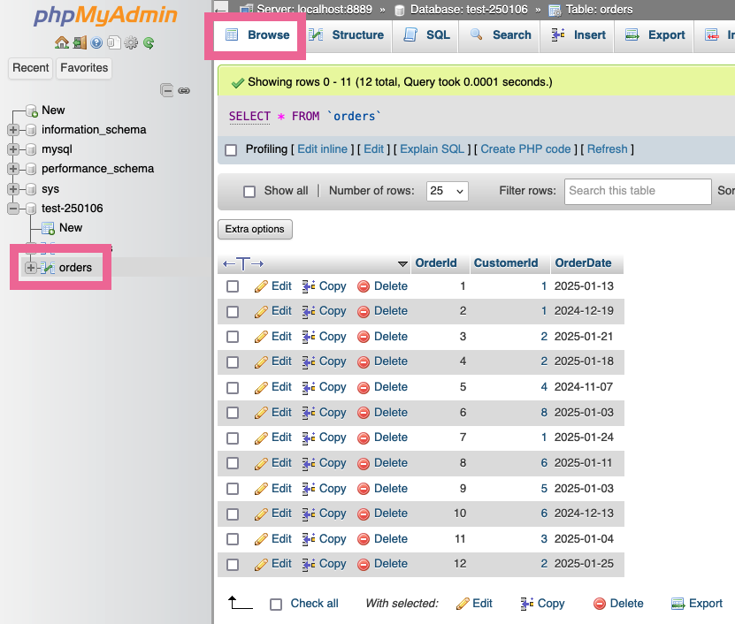

Tip: All the CustomerId's are links...

A bit more examples:

Filter by date, find any orders older than a given date, using less than `<`: 

```sql
SELECT * FROM `orders` WHERE OrderDate < "2025-01-01";
```

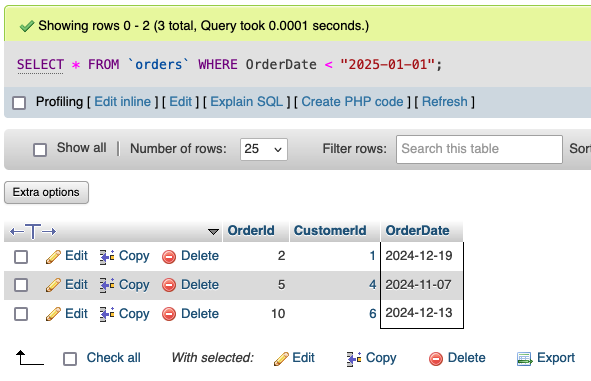


Try the "[ Edit inline ]" link and change from:

```sql
SELECT * FROM `orders` WHERE OrderDate >= "2025-01-01";
```

...to this:
```sql
SELECT * FROM `orders` WHERE OrderDate >= "2025-01-01" ORDER BY OrderDate DESC;
```

What happened?

### JOIN

A `JOIN` clause is used to combine rows from two or more tables, based on a related column between them.

**`INNER JOIN`**: Returns records that have matching values in both tables
**`LEFT JOIN`**: Returns all records from the left table, and the matched records from the right table
**`RIGHT JOIN`**: Returns all records from the right table, and the matched records from the left table
**`CROSS JOIN`**: Returns all records from both tables

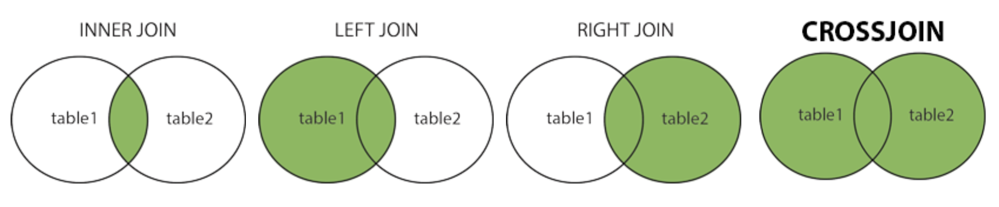
<small>[Source](https://www.w3schools.com/mysql/mysql_join.asp)</small>

#### INNER JOIN

MySQL `INNER JOIN` Example:

The following SQL statement selects all orders with customer information:

```sql
SELECT orders.OrderId, customers.LastName, customers.FirstName
FROM `orders`
INNER JOIN customers ON orders.CustomerId = customers.CustomerId
```

What happens:
* `SELECT orders.OrderId, customers.LastName, customers.FirstName`
Chooses specific columns from two tables.
* `FROM orders`
Starts with the orders table.
* `INNER JOIN customers ON orders.CustomerId = customers.CustomerId`
Combines rows from orders and customers where the CustomerId matches in both tables.

Result:
* One row per order that has a matching customer
* Each row contains:
  * the order ID
  * the customer’s last name
  * the customer’s first name

Orders without a matching customer are not included.

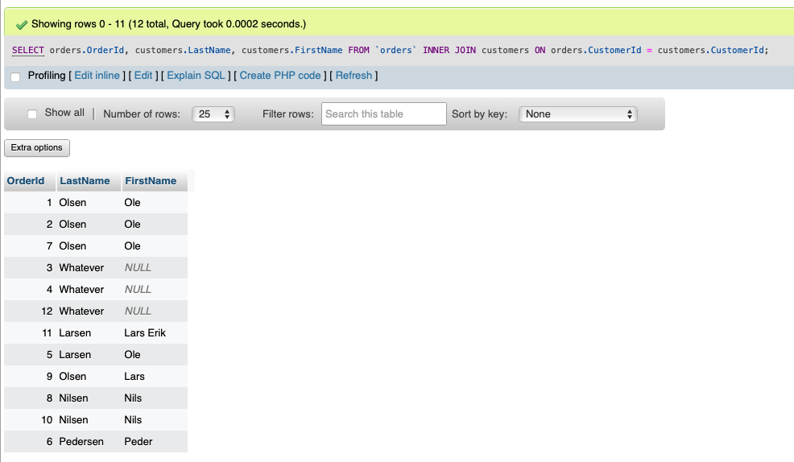

Sidenote about that result:
* The result is a **temporary result set**
* It behaves like a table (rows and columns)
* It exists **only for the duration of the query**
* It is **not stored** in the database unless you explicitly save it

You can think of it as a virtual table created by the `SELECT` statement.

#### CONCAT_WS

If you don't need separate first and last name, then use the `CONCAT_WS` function to merge two (or more) columns and `AS` to make an alias:

```sql
SELECT orders.OrderId, CONCAT_WS(" ", customers.FirstName, customers.LastName) AS Customer
FROM `orders`
INNER JOIN customers ON orders.CustomerId = customers.CustomerId
```

`CONCAT_WS` means “concatenate with separator”.
Here:
* `" "` is the separator (a space)
* `customers.FirstName` and `customers.LastName` are joined together with that space
* `AS Customer` gives the combined result a column name

So the result shows a Customer column like:
`Ole Olsen`, `Lars Erik Larsen`, etc., alongside the `OrderId`:

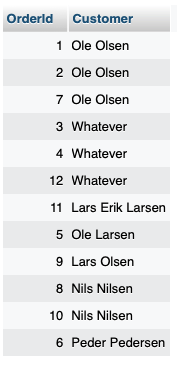

## Sources and resources

[Getting Started with PHP](https://www.php.net/manual/en/getting-started.php)
[PHP Language Reference](https://www.php.net/manual/en/langref.php)

[PHP Tutorial](https://www.w3schools.com/php/default.asp)
[PHP Reference Overview](https://www.w3schools.com/php/php_ref_overview.asp)
[PHP String Functions](https://www.w3schools.com/php/php_ref_string.asp)
[PHP Numbers](https://www.w3schools.com/php/php_numbers.asp)
[PHP Math Functions](https://www.w3schools.com/php/php_ref_math.asp)
[PHP Array Functions](https://www.w3schools.com/php/php_ref_array.asp)
[PHP Operators](https://www.w3schools.com/php/php_operators.asp)

[PHP Form Handling](https://www.w3schools.com/php/php_forms.asp)
[PHP MySQL Database](https://www.w3schools.com/php/php_mysql_intro.asp)
